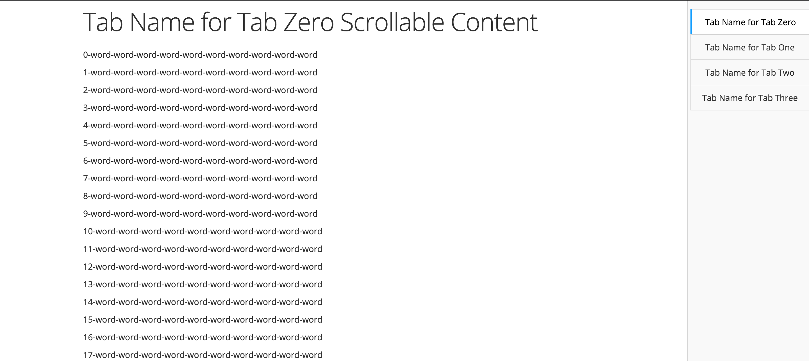

# Dash_Charts

Library for OOP implementation of [Plotly/Dash](https://dash.plot.ly/). Includes base classes for building a custom chart or application, new charts such as a Pareto, and base classes for tabbed or multi-page applications. See full documentation at [https://kyleking.me/dash_charts/](https://kyleking.me/dash_charts/).

<!-- TOC -->

- [Dash_Charts](#dash_charts)
  - [Quick Start](#quick-start)
  - [Local Development](#local-development)
  - [Example Charts](#example-charts)
    - [Pareto Chart](#pareto-chart)
    - [Rolling Mean and STD Chart](#rolling-mean-and-std-chart)
    - [Coordinate Chart](#coordinate-chart)
    - [Alignment Chart](#alignment-chart)
  - [Applications](#applications)
    - [Tabbed Application](#tabbed-application)
  - [External Links](#external-links)

<!-- /TOC -->

## Quick Start

1. Install `dash_charts` from Github with: `pip install git+https://github.com/KyleKing/dash_charts.git` (or in a Poetry project with `pip install dash_charts --git https://github.com/KyleKing/dash_charts.git`)
1. Minimum example:

    ```py
    import dash_html_components as html
    import plotly.express as px
    from dash_charts.pareto_chart import ParetoChart
    from dash_charts.utils_app import AppBase
    from dash_charts.utils_fig import min_graph


    class ParetoDemo(AppBase):
        """Example creating a simple Pareto chart."""

        name = 'Car Share Pareto Demo'
        """Application name"""

        raw_data = None
        """All in-memory data referenced by callbacks and plotted. If modified, will impact all viewers."""

        main_chart = None
        """Main chart (Pareto)."""

        id_chart = 'pareto'
        """Unique name for the main chart."""

        def __init__(self, **kwargs):
            """Initialize app."""
            super().__init__(**kwargs)
            self.raw_data = (px.data.carshare()
                            .rename(columns={'peak_hour': 'category', 'car_hours': 'value'}))
            # self.raw_data =
            self.raw_data['category'] = [f'H:{cat:02}' for cat in self.raw_data['category']]
            self.register_uniq_ids([self.id_chart])

        def register_charts(self):
            """Initialize charts."""
            self.main_chart = ParetoChart(title='Car Share Pareto', xlabel='Peak Hours', ylabel='Car Hours')

        def return_layout(self):
            """Return Dash application layout.

            Returns:
                obj: Dash HTML object. Default is simple HTML text

            """
            return html.Div([
                html.Div([min_graph(
                    id=self.ids[self.id_chart],
                    figure=self.main_chart.create_figure(raw_df=self.raw_data),
                )]),
            ])

        def register_callbacks(self):
            pass  # Override base class. Not necessary for this example


    ParetoDemo().run(debug=True)
    ```

1. Resulting Pareto Chart

    

## Local Development

```sh
git clone https://github.com/KyleKing/dash_charts.git
cd dash_charts
poetry install
poetry shell
python examples/ex_px.py
```

## Example Charts

Below are screenshots and links to the example code for each chart included in dash_charts

### Pareto Chart

Create a Pareto chart in Dash. Handles ordering the category, calculating the cumulative percentage, and configuring both YAxis.

See sample code in [examples/ex_pareto_chart.py](examples/ex_pareto_chart.py). Screenshot below:


### Rolling Mean and STD Chart

Easily chart the rolling mean and standard deviation for a given scatter data set.

See sample code in [examples/ex_rolling_chart.py](examples/ex_rolling_chart.py). Screenshot below:


### Coordinate Chart

Chart a discrete data set on a 2D plane with color for intensity. Below examples show how to use the `CircleGrid()` and `MonthGrid()` classes

See sample code in [examples/ex_coordinate_chart.py](examples/ex_coordinate_chart.py). Screenshot below:


### Alignment Chart

Useful for visualizing misalignment between measured values and expected values. Accepts a `stretch` argument to visually increase the spacing between the measured and expected value.

See sample code in [examples/ex_alignment_chart.py](examples/ex_alignment_chart.py). Screenshot below:


## Applications

Every app derives from `AppBase()` so that each tab or page can be run independently or part of a more complicated application

### Tabbed Application

Use the `AppWithTabs()` base class to quickly build applications with tabbed navigation. You can set tabs to the top/bottom/left/right, to be compact or not, etc.

See sample code in [examples/ex_tabs.py](examples/ex_tabs.py). Screenshot below:




<!-- TODO: Add the multi-page base class -->

## External Links

Useful Dash reference links

- Official [Dash Docs](https://dash.plot.ly) / [Plotly Docs](https://plot.ly/python/)
- Example Apps
  - Pretty annotations from [Market Ahead](https://www.marketahead.com/p/FOX), a commercial Dash app
  - Pleasant dark app from Dash-Bio, [Circos](https://github.com/plotly/dash-bio/blob/master/tests/dashbio_demos/app_circos.py)
  - All [Dash Sample Apps](https://github.com/plotly/dash-sample-apps/tree/master/apps)
- Code Conceptual inspiration
  - [On Tidy data](https://www.jeannicholashould.com/tidy-data-in-python.html)
  - [Using field for properties in a @DataClass](https://florimond.dev/blog/articles/2018/10/reconciling-dataclasses-and-properties-in-python/)
- Best Practices
  - IBM Design Language (note that v2 doesn't have documentation on visualization yet)
    - [Process](https://www.ibm.com/design/v1/language/experience/data-visualization/process/)
    - [Select Chart](https://www.ibm.com/design/v1/language/experience/data-visualization/chart-models/)
      - Alt [Chart Decision Diagram](https://www.tatvic.com/blog/7-visualizations-learn-r/)
    - [Principles (color conventions, etc.)](https://www.ibm.com/design/v1/language/experience/data-visualization/visualization/)
    - [Color Library and Data Vis Swatches](https://www.ibm.com/design/v1/language/resources/color-library/)
    - [Interaction](https://www.ibm.com/design/v1/language/experience/data-visualization/interaction/)
    - [Style](https://www.ibm.com/design/v1/language/experience/data-visualization/style/)
- Colors
  - [Friendly Guide to Colors](https://lisacharlotterost.de/2016/04/22/Colors-for-DataVis/)
  - [Viz-Palette Tool](https://projects.susielu.com/viz-palette)
  - [AI Color Palette](http://colormind.io/) / [Coolors](https://coolors.co/2b303a-92dce5-eee5e9-7c7c7c-d64933)
- Reference
  - [Pandas CheatSheet for Data Manipulation](https://github.com/pandas-dev/pandas/blob/master/doc/cheatsheet/Pandas_Cheat_Sheet.pdf)
