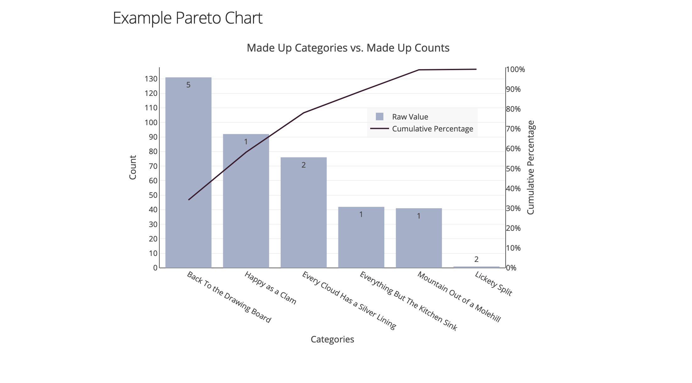

# Dash-Charts

Helpful functions for Plotly Dash apps: https://dash.plot.ly/

## Quick Start

1. Install Poetry: https://github.com/sdispater/poetry
1. (not on PyPi) install from Github with Poetry: `poetry add dash-charts --git `
1. In python:

    ```py
    import dash_charts

    app.layout = html.Div([
        dcc.Graph(figure=dash_charts.createPareto(df)),
    ])
    ```

## Local Development

```sh
git clone https://github.com/KyleKing/Dash-HelloWorld.git
cd Dash-HelloWorld
poetry install
poetry shell
python examples/01_hello_world.py
```

## TODO Tasks (README)

- Rename and publish as PyPi package
- Add tests/configure application
- Checkout the v2 Table Filtering in Dash 0.43
- Check FAQs: https://dash.plot.ly/faqs
- Checkout example charts: https://plot.ly/python/statistical-charts/
  - More examples:
    - https://gist.github.com/chriddyp/9b2b3e8a6c67697279d3724dce5dab3c
    - https://github.com/plotly/dash-recession-report-demo
    - https://github.com/plotly/dash-opioid-epidemic-demo
    - https://github.com/plotly/dash-web-trader
- Test routing: https://dash.plot.ly/urls
- Experiment with sharing state: https://dash.plot.ly/sharing-data-between-callbacks

## Docs

TODO: export documentation as pdoc3 then make available as gh-pages

### Pareto Chart

Create a Pareto chart in Dash. Handles ordering the categories, calculating the cumulative percentage, and configuring both YAxis.



### Alignment Chart

Useful for visualizing misalignment between measured values and expected values. Accepts a `stretch` argument to visually increase the spacing between the measured and expected value.


### Rolling Mean/STD Chart

Easily chart the rolling mean and standard deviation for a given scatter data set.


