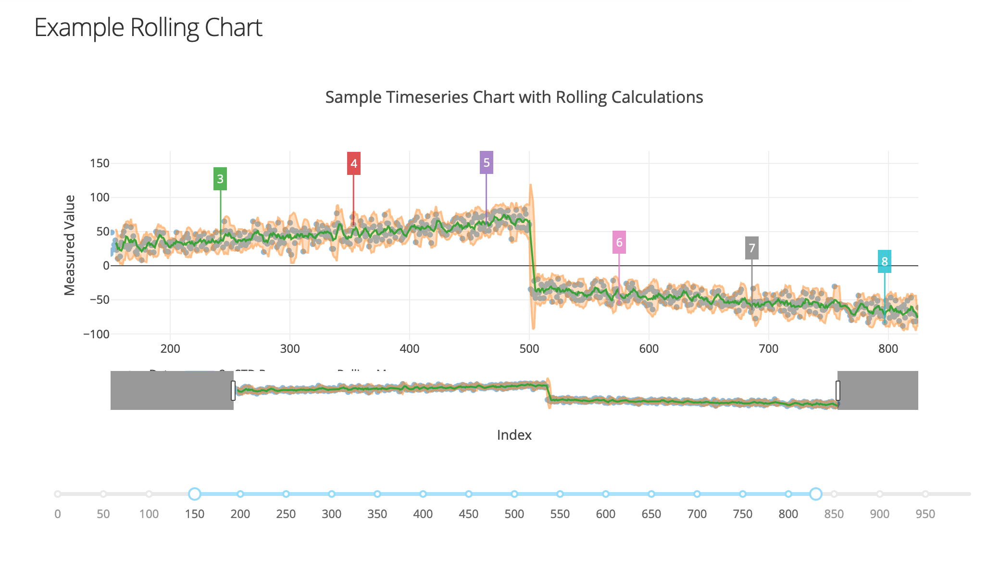
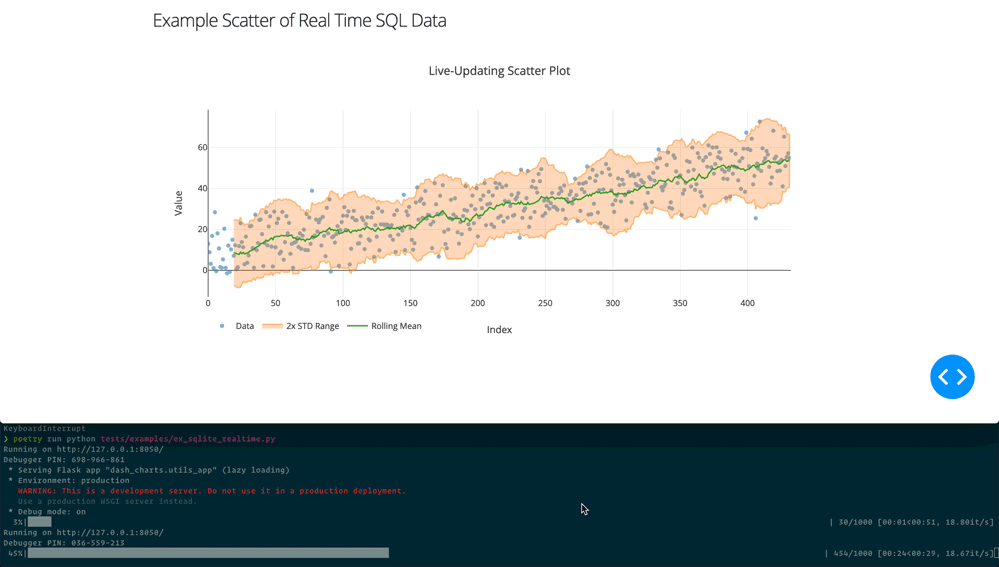
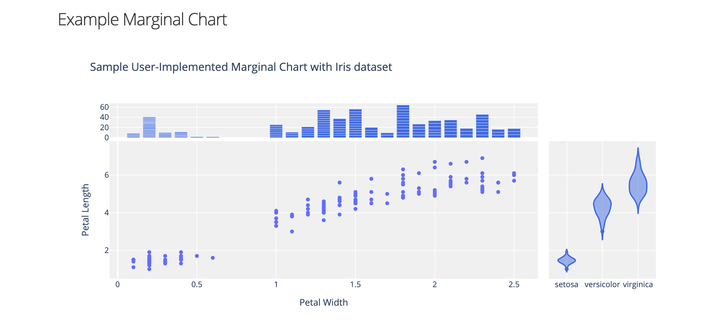
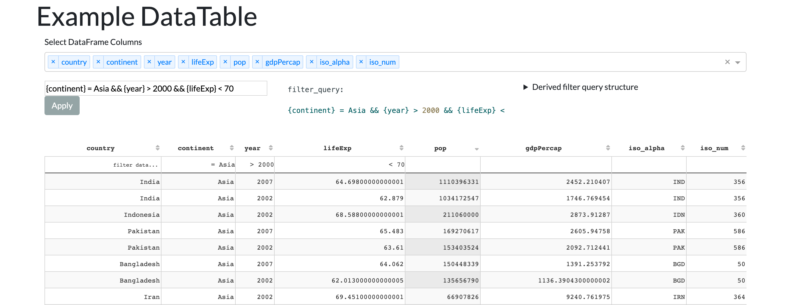
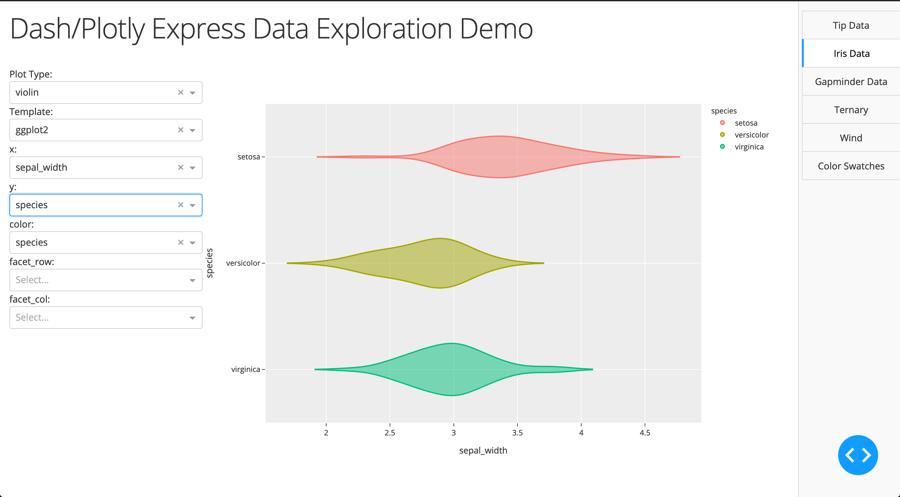

# Dash_Charts

Library for OOP implementation of [Plotly/Dash](https://dash.plot.ly/). Includes base classes for building a custom chart or application, new charts such as a Pareto, and base classes for tabbed or multi-page applications. See full documentation at [https://kyleking.me/dash_charts/](https://kyleking.me/dash_charts/).

<!-- TOC -->

- [Dash_Charts](#dash_charts)
  - [Quick Start](#quick-start)
  - [Design Principles](#design-principles)
  - [Local Development](#local-development)
  - [Example Charts and Tables](#example-charts-and-tables)
    - [Pareto Chart](#pareto-chart)
    - [Rolling Mean and STD Chart](#rolling-mean-and-std-chart)
    - [Real Time SQL Demo](#real-time-sql-demo)
    - [Coordinate Chart](#coordinate-chart)
    - [Marginal Chart](#marginal-chart)
    - [Data Table](#data-table)
  - [Applications](#applications)
    - [Tabbed Application](#tabbed-application)
    - [Multi-Page Application](#multi-page-application)
    - [PX Generic Application](#px-generic-application)
  - [Coverage](#coverage)
  - [External Links](#external-links)

<!-- /TOC -->

## Quick Start

1. Install `dash_charts` from Github with: `pip install git+https://github.com/KyleKing/dash_charts.git` (or in a Poetry project with `pip install dash_charts --git https://github.com/KyleKing/dash_charts.git`)
1. Minimum example:

    <!-- CODE:tests/examples/readme.py -->

    ```py
    import dash_html_components as html
    import plotly.express as px
    from dash_charts.pareto_chart import ParetoChart
    from dash_charts.utils_app import AppBase
    from dash_charts.utils_fig import min_graph


    class ParetoDemo(AppBase):
        """Example creating a simple Pareto chart."""

        name = 'Car Share Pareto Demo'
        """Application name"""

        data_raw = None
        """All in-memory data referenced by callbacks and plotted. If modified, will impact all viewers."""

        chart_main = None
        """Main chart (Pareto)."""

        id_chart = 'pareto'
        """Unique name for the main chart."""

        def initialization(self):
            """Initialize ids with `self.register_uniq_ids([...])` and application data."""
            super().initialization()
            self.register_uniq_ids([self.id_chart])
            # Format the car share data from plotly express for the Pareto
            self.data_raw = (px.data.carshare()
                             .rename(columns={'peak_hour': 'category', 'car_hours': 'value'}))
            self.data_raw['category'] = [f'H:{cat:02}' for cat in self.data_raw['category']]

        def create_elements(self):
            """Initialize the charts, tables, and other Dash elements."""
            self.chart_main = ParetoChart(title='Car Share Pareto', xlabel='Peak Hours', ylabel='Car Hours')

        def return_layout(self):
            """Return Dash application layout.

            Returns:
                dict: Dash HTML object

            """
            return html.Div([
                html.Div([min_graph(
                    id=self.ids[self.id_chart],
                    figure=self.chart_main.create_figure(df_raw=self.data_raw),
                )]),
            ])

        def create_callbacks(self):
            """Register the callbacks."""
            pass  # Override base class. Not necessary for this example


    if __name__ == '__main__':
        app = ParetoDemo()
        app.create()
        app.run(debug=True)

    ```

    <!-- /CODE:tests/examples/readme.py -->

1. Resulting Pareto Chart

    

## Design Principles

I wanted to show that an object oriented programming approach to Dash projects could be really powerful for improving code reuse and improving readability in large projects. Below are a couple of design principles to keep that I try to keep in mind when implementing this package.

- Try to encapsulate all application logic (callbacks, ids, etc.) in application classes or modules
- For components that are reused between application, create a `module`. The layout, state, and callbacks can all be delegated to the module rather than cluttering the main application's class and allowing for better code reuse
- Move any methods that don't require state (`self`) into standalone functions
- If you can separate Dash (ids/layout/Callbacks) and Plotly (figures/tables) code, you can generate static HTML or PNGs more easily. Sometimes static output is useful when programmatically generating views rather than tweaking the interactive inputs each time.

Overall, I find that this package really improves my Dash code and I hope others find it useful. Please feel free to submit PRs or open issues if you have any input

## Local Development

```sh
git clone https://github.com/KyleKing/dash_charts.git
cd dash_charts
poetry install
poetry shell
python tests/examples/ex_app_px.py
```

## Example Charts and Tables

Below are screenshots and links to the example code for each chart or table included in dash_charts

### Pareto Chart

Create a Pareto chart in Dash. Handles ordering the category, calculating the cumulative percentage, and configuring both YAxis.

See sample code in [tests/examples/ex_pareto_chart.py](tests/examples/ex_pareto_chart.py). Screenshot below:


### Rolling Mean and STD Chart

Easily chart the rolling mean and standard deviation for a given scatter data set. Demonstrates using chart annotations.

See sample code in [tests/examples/ex_rolling_chart.py](tests/examples/ex_rolling_chart.py). Screenshot below:



### Real Time SQL Demo

Example using a Rolling Chart to show real time data from a SQLite database. For the demo, a background thread populates the database as the Dash app runs in a separate thread.

See sample code in [tests/examples/ex_sqlite_realtime.py](tests/examples/ex_sqlite_realtime.py). Screenshot below:



### Coordinate Chart

Chart a discrete data set on a 2D plane with color for intensity. Below examples show how to use the `YearGrid()`, `MonthGrid()`, and `CircleGrid()` classes

See sample code in [tests/examples/ex_coordinate_chart.py](tests/examples/ex_coordinate_chart.py). Screenshot below:


### Marginal Chart

Example creating a new chart from utils_fig.MarginalChart

See sample code in [tests/examples/ex_marginal_chart.py](tests/examples/ex_marginal_chart.py). Screenshot below:



### Data Table

Display Dash data table from dataframe

See sample code in [tests/examples/ex_datatable.py](tests/examples/ex_datatable.py). Screenshot below:



## Applications

Every app derives from `AppBase()` so that each tab or page can be run independently or part of a more complicated application

### Tabbed Application

Use the `AppWithTabs()` base class to quickly build applications with tabbed navigation. You can set tabs to the top/bottom/left/right, to be compact or not, etc.

See sample code in [tests/examples/ex_tabs.py](tests/examples/ex_tabs.py). Screenshot below:


### Multi-Page Application

Use the `AppMultiPage()` base class to quickly build applications with tabbed navigation. You can set tabs to the top/bottom/left/right, to be compact or not, etc.

See sample code in [tests/examples/ex_multi_page.py](tests/examples/ex_multi_page.py). Screenshot below:


### PX Generic Application

To facilitate general data analysis from a JSON, CSV, or SQLite file, dash_charts includes apps for each px plot type and a tabbed app to bring them all together.

See sample code in [tests/examples/ex_app_px.py](tests/examples/ex_app_px.py). Screenshot below:



## Coverage

Latest coverage table

<!-- COVERAGE -->

| File | Statements | Missing | Excluded | Coverage |
| --: | --: | --: | --: | --: |
| __init__.py | 1 | 0 | 0 | 100.0 |
| app_px.py | 108 | 11 | 0 | 89.8 |
| components.py | 8 | 0 | 0 | 100.0 |
| coordinate_chart.py | 105 | 1 | 6 | 99.0 |
| custom_colorscales.py | 4 | 0 | 0 | 100.0 |
| dash_helpers.py | 6 | 0 | 6 | 100.0 |
| datatable.py | 51 | 0 | 0 | 100.0 |
| equations.py | 11 | 0 | 0 | 100.0 |
| fitted_chart.py | 37 | 1 | 5 | 97.3 |
| grouped_bar.py | 0 | 0 | 0 | 100.0 |
| modules_datatable.py | 97 | 11 | 0 | 88.7 |
| pareto_chart.py | 39 | 0 | 2 | 100.0 |
| rolling_chart.py | 23 | 1 | 0 | 95.7 |
| time_vis.py | 0 | 0 | 0 | 100.0 |
| utils_app.py | 55 | 1 | 8 | 98.2 |
| utils_app_modules.py | 17 | 2 | 2 | 88.2 |
| utils_app_with_navigation.py | 97 | 9 | 6 | 90.7 |
| utils_callbacks.py | 25 | 1 | 0 | 96.0 |
| utils_fig.py | 66 | 2 | 4 | 97.0 |

Generated on: 2020-03-22T09:07:25.271839

<!-- /COVERAGE -->

## External Links

[](https://codebeat.co/projects/github-com-kyleking-dash_charts-master) [](https://kyleking.me/dash_charts/)  

Useful Dash reference links

- Official [Dash Docs](https://dash.plot.ly) / [Plotly Docs](https://plot.ly/python/)
- Example Apps
  - Pretty annotations from [Market Ahead](https://www.marketahead.com/p/FOX), a commercial Dash app
  - Pleasant dark app from Dash-Bio, [Circos](https://github.com/plotly/dash-bio/blob/master/tests/dashbio_demos/app_circos.py)
  - All [Dash Sample Apps](https://github.com/plotly/dash-sample-apps/tree/master/apps)
- Code Conceptual inspiration
  - [On Tidy data](https://www.jeannicholashould.com/tidy-data-in-python.html)
  - [Using field for properties in a @DataClass](https://florimond.dev/blog/articles/2018/10/reconciling-dataclasses-and-properties-in-python/)
- Best Practices
  - IBM Design Language (note that v2 doesn't have documentation on visualization yet)
    - [Process](https://www.ibm.com/design/v1/language/experience/data-visualization/process/)
    - [Select Chart](https://www.ibm.com/design/v1/language/experience/data-visualization/chart-models/)
      - Alt [Chart Decision Diagram](https://www.tatvic.com/blog/7-visualizations-learn-r/)
    - [Principles (color conventions, etc.)](https://www.ibm.com/design/v1/language/experience/data-visualization/visualization/)
    - [Color Library and Data Vis Swatches](https://www.ibm.com/design/v1/language/resources/color-library/)
    - [Interaction](https://www.ibm.com/design/v1/language/experience/data-visualization/interaction/)
    - [Style](https://www.ibm.com/design/v1/language/experience/data-visualization/style/)
- Colors
  - [Friendly Guide to Colors](https://lisacharlotterost.de/2016/04/22/Colors-for-DataVis/)
  - [Viz-Palette Tool](https://projects.susielu.com/viz-palette)
  - [AI Color Palette](http://colormind.io/) / [Coolors](https://coolors.co/2b303a-92dce5-eee5e9-7c7c7c-d64933)
- Reference
  - [Pandas CheatSheet for Data Manipulation](https://github.com/pandas-dev/pandas/blob/master/doc/cheatsheet/Pandas_Cheat_Sheet.pdf)
